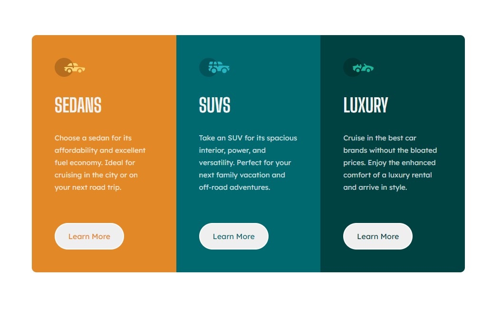

# Frontend Mentor - 3-column preview card component solution

This is a solution to the [3-column preview card component challenge on Frontend Mentor](https://www.frontendmentor.io/challenges/3column-preview-card-component-pH92eAR2-). Frontend Mentor challenges help you improve your coding skills by building realistic projects. 

## Table of contents

- [Overview](#overview)
  - [The challenge](#the-challenge)
  - [Screenshot](#screenshot)
  - [Links](#links)
- [My process](#my-process)
  - [Built with](#built-with)
  - [What I learned](#what-i-learned)
  - [Continued development](#continued-development)
  - [Useful resources](#useful-resources)
- [Author](#author)


## Overview

### The challenge

Users should be able to:

- View the optimal layout depending on their device's screen size
- See hover states for interactive elements

### Screenshot



Hover state for interactive element:


### Links

- Solution URL: [Frontend Mentor](https://www.frontendmentor.io/solutions/3column-preview-card-component-section-using-sass-Dgk9eyl-i)
- Live Site URL: [Github Pages](https://timmartin13.github.io/3-column-preview-card-component-main/)

## My process

### Built with

- Semantic HTML5 markup
- SCSS custom properties
- Flexbox
- Mobile-first workflow

### What I learned

I learned more about nesting tags in SCSS, and using the same classes for each section so that I can style them all at the same time.

```css
&:hover {
  background-color: transparent;
  color: $trans-white;
}
```


### Continued development

I want to continue working on SCSS functionality and start moving my projects into my React library.


### Useful resources

- [Flexbox](https://css-tricks.com/snippets/css/a-guide-to-flexbox/) - The best Flexbox cheatsheet I have found.
- [Sass](https://sass-lang.com/documentation/syntax) - Sass documentation really helps.


## Author

- Website - [Tim Martin Portfolio](https://timmartin13.github.io/react-portfolio/)
- Frontend Mentor - [@TimMartin13](https://www.frontendmentor.io/profile/TimMartin13)

